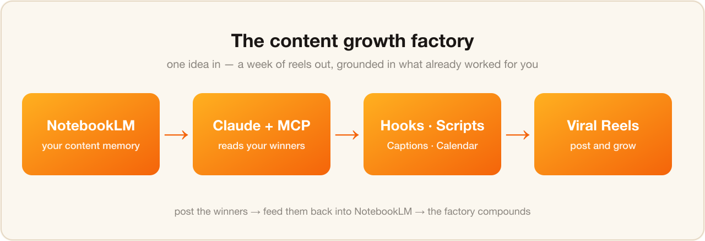
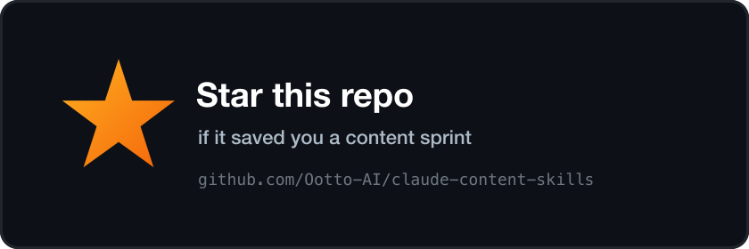

# Claude Content Skills

**Free, copy-paste Claude skills that run your content growth factory** — turn ideas (and your NotebookLM memory) into scroll-stopping Instagram reels: hooks, scripts, repurposing, captions, and a 2-week posting calendar.


[](https://claude.ai/claude-code)
[](LICENSE)
[](https://www.ootto.ai)
[](https://github.com/Ootto-AI/claude-content-skills)

> Built by **[Ootto](https://www.ootto.ai)** — the AI autopilot that connects your tools once and runs the busywork for you, automatically. These skills are the manual, do-it-yourself version. [Ootto](https://www.ootto.ai) is the autopilot. **[See it in 3 minutes →](https://www.ootto.ai)**

## What this is

Five Claude "skills" for the content side of growing a business — the repeatable pipeline that turns one idea (or one long video) into a week of reels. Each is a structured prompt that does one job. No code, no editing suite.

| Skill | What it does |
|-------|--------------|
| [Viral Hook Writer](skills/viral-hook-writer/SKILL.md) | 10 scroll-stopping hooks for the first 1-3 seconds, ranked for what to test first. |
| [Reel Scripter](skills/reel-scripter/SKILL.md) | Turns an idea or hook into a tight 30-45s script with spoken lines + on-screen text. |
| [Content Repurposer](skills/content-repurposer/SKILL.md) | Turns one blog post / podcast / video into 5+ reel ideas and outlines. |
| [Caption & Hashtags](skills/caption-and-hashtags/SKILL.md) | Caption, tiered hashtag set, and a first comment built for saves and reach. |
| [Content Calendar](skills/content-calendar/SKILL.md) | Sequences your ideas into a postable 2-week reel calendar with formats and hooks. |

## ⭐ The secret weapon: your NotebookLM memory

Generic AI content sounds generic. The fix is **memory** — give Claude what's already worked for *you*.

Connect **Google NotebookLM** to Claude with the open-source [`notebooklm-mcp`](https://www.npmjs.com/package/notebooklm-mcp) server, fill a notebook with your past winning reels, transcripts, brand voice, and a competitor swipe file — and every skill above generates from **your** proven patterns instead of a blank slate.



**The full step-by-step (NotebookLM → Claude via MCP, then the factory workflow) is here: [ootto.ai/blog →](https://www.ootto.ai/blog)**

> ⚠️ `notebooklm-mcp` is a community tool that drives NotebookLM via browser automation (a one-time Google login). It's not an official Google/Anthropic integration — great for personal use; mind NotebookLM's terms.

## Installation

**Claude Code plugin marketplace (recommended):**

```
/plugin marketplace add Ootto-AI/claude-content-skills
/plugin install claude-content-skills@ootto-content-skills
```

**Manual (macOS / Linux):**

```bash
git clone --depth 1 https://github.com/Ootto-AI/claude-content-skills.git
bash claude-content-skills/install.sh
```

Both copy the skills into `~/.claude/skills/`. Restart Claude Code and the skills are available.

**No Claude Code? Just paste them.** Every skill file is a plain prompt — open it on GitHub, copy the prompt, and paste it into [claude.ai](https://claude.ai) with your idea.

## How to use

1. Run a skill (e.g. `/viral-hook-writer`) or paste its prompt into Claude.
2. Give it your topic, audience, and goal.
3. Get hooks → scripts → captions → a calendar. Film, post, then feed the winners back into your NotebookLM so the factory compounds.

## ⭐ Star this repo

If these save you a content sprint, **[drop a star](https://github.com/Ootto-AI/claude-content-skills)** — it helps other small teams find them, and tells us which skill packs to build next.

<a href="https://github.com/Ootto-AI/claude-content-skills"></a>

## Want it on autopilot? Meet Ootto

Running these by hand still means *you* open Claude, paste the idea, and post the reel. **[Ootto](https://www.ootto.ai)** does the operations side for you — it connects your tools once, learns how your business works, and runs invoicing, lead follow-up, and reporting automatically, so you get your time back to actually create.

- **Connects in ~3 minutes.** No workflows to build.
- **Self-learning.** It reads your history instead of asking you to configure rules.
- **Done-for-you.** The skills are manual mode; Ootto is autopilot.

**[Book a 15-minute demo →](https://www.ootto.ai)**

## License

MIT — see [LICENSE](LICENSE). Use them, fork them, adapt them.

---

Part of the Ootto Skills family: invoicing, inbox, leads, scheduling, reporting, support — and now content. **[ootto.ai →](https://www.ootto.ai)**
